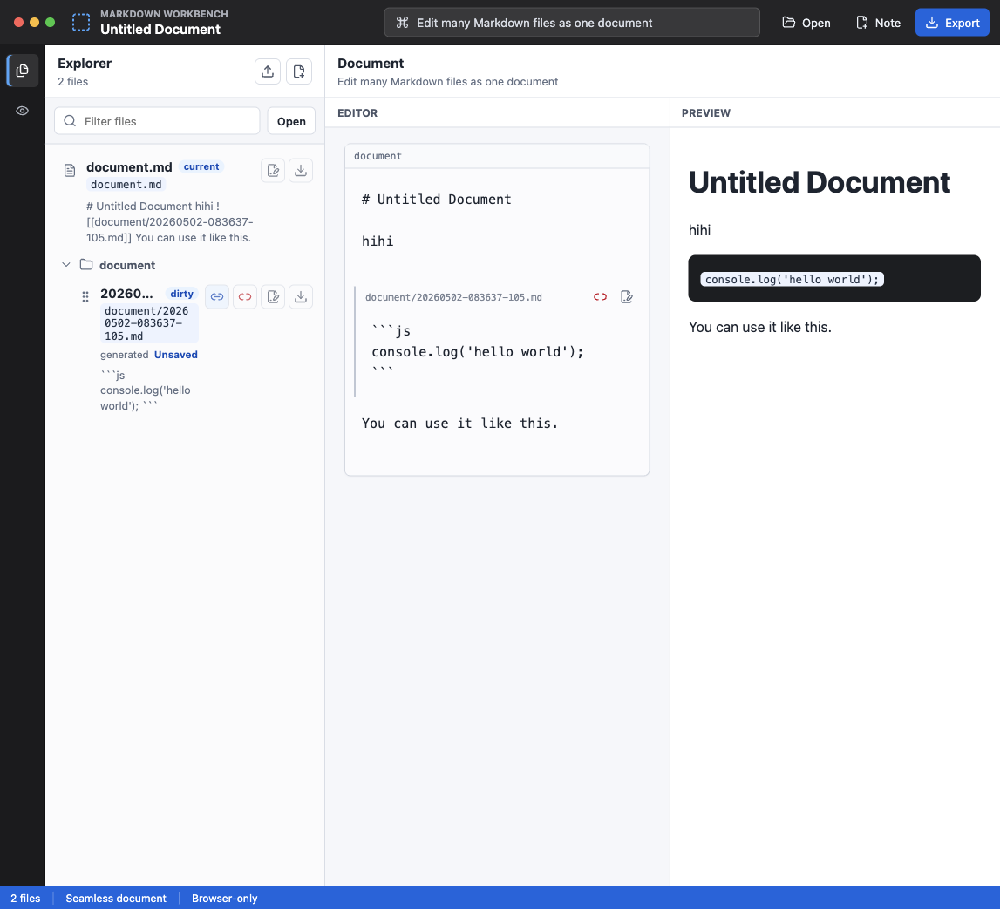

# Mamo

A proof of concept for Markdown that can be structured hierarchically.



Mamo explores a seamless way to compose many Markdown files as if they were one large document. Each Markdown file stays independently editable, while the workbench renders the hierarchy as a continuous document with a live preview.

## What It Does

- Edit a root document and embedded Markdown files in one continuous editor.
- Split content into a new child Markdown file with `--doc--` or `--앷--`.
- Reorder embedded documents from the Explorer or directly from editor titles.
- Move child documents into parent document insertion points.
- Rename Markdown files while automatically updating embed references.
- Insert and remove shared references without deleting the underlying file.
- Export the rendered Markdown document.

## Tech Stack

- Vite
- React
- TypeScript
- Zustand
- dnd-kit
- react-markdown
- Vitest

## Development

```bash
bun install
bun run dev
```

Open `http://127.0.0.1:5174/` or the URL printed by Vite.

## Verification

```bash
bun run test:run
bun run build
```

## Status

This is an early browser-only proof of concept. File import/export is the durable boundary; browser storage and backend persistence are intentionally outside the current scope.
